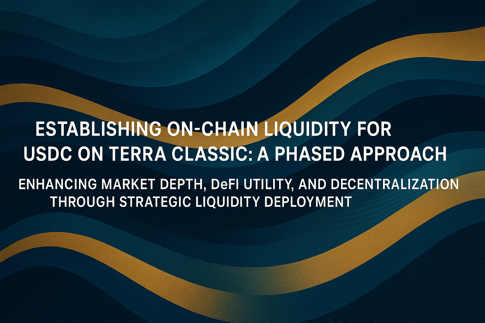
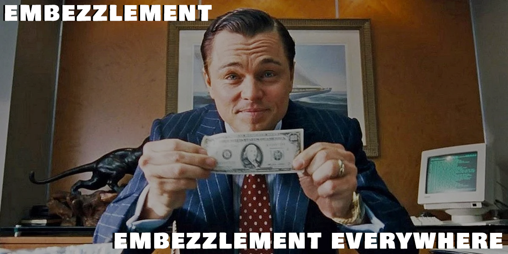

## Phased Approach to Establish On-Chain Liquidity for USDC on Terra Classic

    

### Motivation

Currently, **Terra Classic lacks a direct on-chain stablecoin trading pair for LUNC**, forcing users to rely on centralized exchanges (CEXs) for stable conversions. This reliance introduces **liquidity fragmentation, higher slippage, and centralized risks**, limiting the efficiency of on-chain trading and DeFi applications. Without a stable LUNC pair, users face difficulty executing trades with predictable pricing, affecting traders, liquidity providers, and developers building on Terra Classic. The lack of on-chain liquidity also **inhibits the development of DeFi infrastructure**, which typically relies on the availability of on-chain stablecoins.

The introduction of a USDC/LUNC liquidity pools will address these challenges by:

- **Enhancing market depth and liquidity**: Matching Binance’s ±2% market depth of \~\$50K–\$100K ensures smoother on-chain trading.

- **Providing DeFi utility**: A stable LUNC pair enables lending, borrowing, and yield farming applications, attracting more users and increasing TVL (Total Value Locked) in the ecosystem.

- **Reducing dependence on CEXs**: On-chain liquidity removes the need to use off-chain platforms for stablecoin conversions, improving decentralization and reducing counterparty risks. Furthermore, on-chain DeFi applications *cannot* interoperate with CEXs and therefore depend on DEX liquidity.

- **Creating arbitrage opportunities with CEX stable pairs**: A liquid on-chain USDC/LUNC market allows traders to exploit price differences between Terra Classic and CEXs, fostering increased on-chain activity and organic trading volume.

- **Supporting existing DEX platforms**: Injecting liquidity into DEX's helps these platforms increase their trading volume, attracting more users and improving overall ecosystem efficiency and visibility.

- **Putting Community Funds to Work**. Up until now, community funds have been sitting dormant in the Community Pool. This proposal presents an opportunity to earn yield from this capital through swap fees on the seeded liquidity.

- **Burns**. A native LUNC/USDC pair will generate tax volume and, therefore, LUNC burns, Community Pool funding and Oracle Pool funding. There are other off-chain platforms to swap LUNC/USDC, but these usually do not account for Terra Classic's on chain taxes.

### Execution Plan

    

1. Establish a multisig escrow account with nine signers, requiring six agreeing voting members to carry out a transaction. The multisig (MS) will be created using the DAODAO platform on Terra Classic.

2. Eligible DEXs on Terra Classic can apply for liquidity seeding by submitting a spending proposal into the established multisig account (step 1). Passing such a proposal instructs the MS owners to carry out the following transactions on behalf of the community. Eligible DEX platforms are defined later in this document.

3. Split the spending request into multiple installments to control the flow of LUNC into the market without creating excessive volatility.

4. The multisig owners will transfer 50% of the spending requests from step 2 into Binance for swapping. A selected, trusted multisig member will manage these funds on the centralized platform. The trusted member will swap the amount according to a strategy introduced later in this document.

5. Transfer the acquired USDC to Coinbase. This step is necessary because Coinbase has a withdrawal function to transfer USDC to the native issuance chain of USDC for the Cosmos ecosystem (see next step).

6. From Coinbase, withdraw USDC to Noble.

7. Bridge USDC from Noble to Terra Classic via the IBC network. The receiving wallet for this transaction will be the original multisig wallet from step (1).

8. Deploy the allocated liquidity in equal parity to a newly created LUNC/USDC pair on the DEX that requested funding for this installment. The multisig wallet will acquire LP tokens from the transaction as a receipt for the liquidity it provided.

9. The multisig will send the acquired LP tokens to the Terra Classic governance account. From there, the LP tokens can be managed in a **fully decentralized** manner.

### Application Eligibility

The applying DEXs shall fulfill the following requirements to receive liquidity funding:

- Audit report for their platform
- Team KYC
- Community approval of a spending proposal into the escrow wallet

### Multisig Signers

We propose the following list of multisig signers. These are individuals and validators who have demonstrated strong support for the LUNC ecosystem over the long run:

- LuncGoblins
- LuncLive
- JurisProtocol
- Vegas
- Hexxagon
- Rexyz
- Nicolas Boulay
- Garuda
- JESUSisLORD
- Allnodes
- Renzo

This is a large, broad, and diverse group of respected community members. This initiative aims to unite different factions and create a valuable effort for the chain.

### Community Ownership and Non-Commercial Nature

At all times, the funds involved in this proposal, including both the initial LUNC allocation and the corresponding USDC swap outputs as well as the resulting pooled liqudity, remain community-owned. The multisig wallet and the use of centralized exchanges serve only as mechanisms to facilitate and manage the liquidity deployment. The multisig signers act on a fully voluntary basis, ensuring that no individual or entity profits, enriches themselves, or engages in commercial activities through this process. The funds will always be directed towards the community-driven goal of establishing on-chain liquidity, and all actions are taken transparently and in good faith. The multisig signers will also get no financial compensation for their actions to ensure the non-commercial nature of this initiative.

### High-Risk CEX Trades

This proposal involves using centralized exchanges to acquire USDC, which can only be undertaken by a single entity or individual due to the nature of CEXs. We acknowledge that this approach goes against the decentralized practices traditionally followed on Terra Classic. However, USDC cannot currently be acquired on the DEX market due to insufficient on-chain liquidity—precisely the problem this proposal aims to solve.

This proposal nominates **LuncGoblins** aka **Fragwuerdig** (real name: Till Ziegler) to handle these high-risk trades. He is a well-respected and trusted community member with KYC certification through SolidProof ([SolidProof KYC](https://github.com/solidproof/projects/tree/main/2024/Fragwuerdig)). He has no reason or incentive to embezzle this grant.

    

The risk of partial or full loss of funds due to human or technical error can be mitigated by splitting the spending proposal into multiple installments. Internally, these installments will be further divided into three equal parts, ensuring that each trade only involves approximately \$2.5K.

### Price Impact and Acquisition Strategy

This proposal seeks to minimize the price impact on LUNC by matching the ±2% depth of the centralized market on Binance. This means that when a single trade with 50% of the two-sided target liquidity is executed, the price is expected to move only 2% downward. However, to further mitigate negative price movements, the acquisition will occur in several trades. The swaps will only be executed during an upward market movement on the 4-hour timeframe. Additionally, trades will not be initiated using a Market Order but rather with a Limit Order at the current market price (Stop Limit) to minimize exposure to slippage.

### Summary

This proposal aims to establish a liquid and stable trading environment for LUNC, bringing Terra Classic closer to a robust DeFi ecosystem while reducing reliance on centralized exchanges. By splitting the funding request into multiple spend proposals and using a multisig account, we ensure a controlled, strategic approach that minimizes market disruption while achieving our liquidity goals in a relatively decentralized manner. After deployment, the liquidity will be managed entirely through Terra Classic governance.

### Voting Options

**YES** – Approve the phased allocation of LUNC from the community pool for this liquidity initiative.

**NO** – Reject the proposal and maintain the current liquidity structure.
