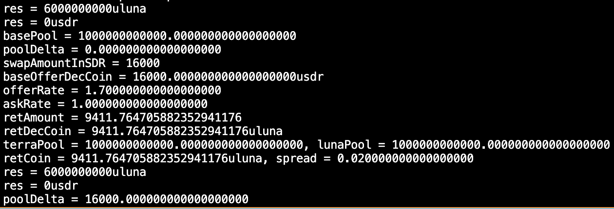

# This is research piece on uluna supply constraint topic

The constrainedpool logic was part of the initial PR that formed TR back in June:
https://github.com/terra-money/classic-core/pull/778/files#diff-81594c0e59559d8705e1dd34fabbc9a8ab355da6b0d3b396686fecf1527567bb

It has been peer reviewed by Raider, Ed, Resolvence, Maxb to name a few. It has been tested with unit tests, integration tests, etc, etc.

The current target number of 2000000000000 was selected simply to avoid having to refactor all the other tests which would start bumping into issues. At the time it was my understanding that it was 2T. Being that sdk.Dec works differently then I initially assumed that number has to be corrected, but seeing how that was always the case, there was no real idea behind altering it until people could be convinced that  3568 covers the "supply constraint" or a new prop could be passed.

# The mechanism of swap offer coin <-> ask coin

There are two steps in this mechanism:
* Oracle - based swap
* Update pool

## Oracle based swap

1. Offer <-> SDR:
    * rate1 = Offer/Luna (Exchange rate is updated by Oracle)
    * rate2 = SDR/Luna (Exchange rate is updated by Oracle)
    * SDR/Offer = rate2/rate1
    * (Offer coin)* SDR/Offer = SDR coin
2. SDR <-> Ask:
    * rate1 = SDR/Luna (Exchange rate is updated by Oracle)
    * rate2 = Ask/Luna (Exchange rate is updated by Oracle)
    * Ask/SDR = rate2/rate1
    * (SDR coin)* Ask/SDR = Ask coin

Swapping from **Offer coin** to **Ask coin** has to go through intermediary coins SDR and Luna

## Update pool

**LunaPool and Luna total supply doesn't have logic to bind them to each others**. It means that LunaPool and Luna total supply value can be different from each others.

CP (constant) = (TerraPool + delta) * LunaPool * (LunaPrice / SDRPrice)
CP (constant) = BaseTerraPool^2 (TerraPool = LunaPool * (LunaPrice / SDRPrice) initially)

* TerraPool (10000 SDR + 0 SDR) * LunaPool (20000) * 0.5 = 10000^2 (delta = 0 SDR)
* Swap 1000 SDR to 2000 Luna
* (10000) * LunaPool = 10000^2
* TerraPool = 10000, LunaPool = 10000 (this is due to delayed terra pool delta update)
* TerraTotalSupply = 9000 SDR
* LunaTotalSupply = 22000 Luna
* UpdateTerraPoolDelta = 1000 (only in the next swap do TerraPool, LunaPool reflects change)

# Assume that LunaTotalSupply is capped at a constant

Call C as capped constant for LunaTotalSupply

If LunaTotalSupply = C, no more minting will be done to LunaTotalSupply.

For every transaction that swap SDR <-> Terra, the amount of TerraTotalSupply will reduce, while the amount of LunaTotalSupply will remain the same. Instead of exchange rate Luna/SDR = (LunaTotalSupply + Ask)/(TerraTotalSupply - Offer), it will be (LunaTotalSupply)/(TerraTotalSupply - Offer). It will lead to exchange rate getting more wrong over time.

* 10000/20000 = 0.5 | 10000/20000 = 0.5
* 9000/20000 = 0.45 | 9000/22000 = 0.41

Since LunaPool is calculated based on TerraPool, LunaPool = CP/(TerraPool + Delta)

* 10000^2/10000 = 10000 | 10000^2/10000 = 10000 (Delta = 0)
* 10000^2/11000 = 9090.91 | 10000^2/11000 = 9090.91 (Delta = 1000)

TODO: Write a test to check what will happen with LunaTotalSupply, SDRTotalSupply, LunaPool, TerraPool over multiple swap with uncapped and capped situation.